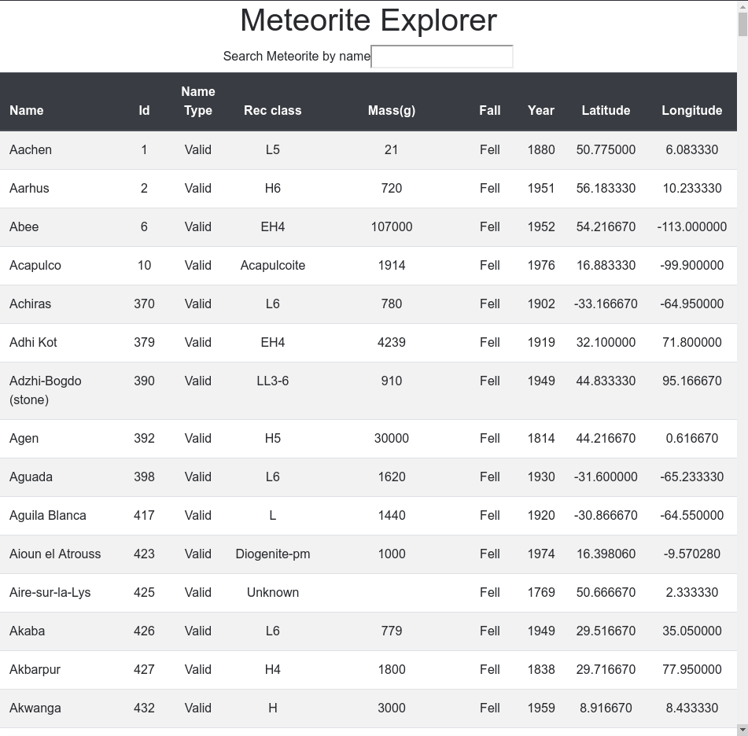

### Meteorite Explorer

An application that provides users with the ability to explore meteorite strikes across the globe by searching the [Meteorite Landing dataset](https://data.nasa.gov/Space-Science/Meteorite-Landings/gh4g-9sfh) on the "Nasa Open Data" Portal.

### Tech Stack

- Express
- React
- Node

### Downloading

- clone this repo or download the zip files
- cd into the directory

### Requirements

- Environment variables in the `.env` file in the "backend" directory

| Name        | Required | Description         |
| ----------- | -------- | ------------------- |
| `PORT`      | yes      | Express server port |
| `APP_TOKEN` | yes      | Socrata App-token   |

## First run server:

1. In a separate terminal, navigate to the backend folder
2. run `npm install`
3. run `npm start`

## To see the app in the browser client:

1. In the root folder: run `npm install`
2. run `npm start`
3. See results in the browser

